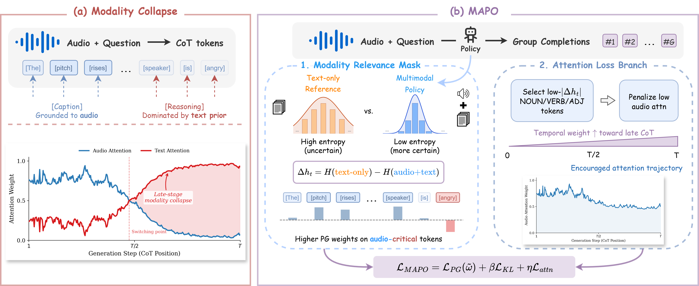
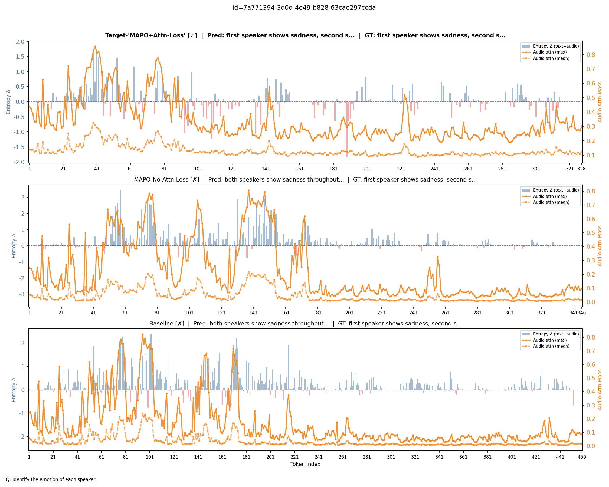
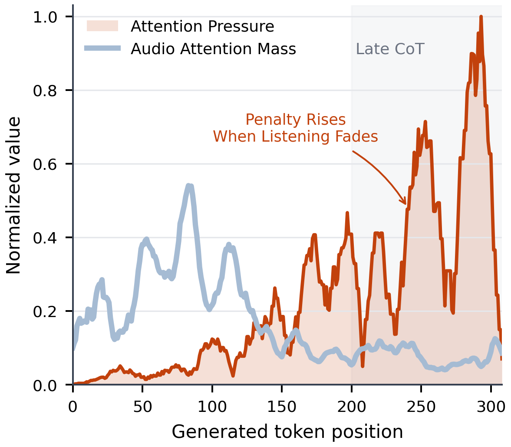

<div align="center">
  <h1>MAPO</h1>
  <h3>Modality-Aware Policy Optimization</h3>
  <p><em>Escape the Language Prior — Mitigating Late-Stage Modality Collapse in Audio Reasoning</em></p>
  <a href="https://arxiv.org/abs/2605.27741">
    
  </a>
</div>

---

## Overview

Audio and omni-modal LLMs exhibit impressive cross-modal reasoning, yet standard RL post-training (GRPO, PPO, DPO) applies **uniform policy gradients across all tokens**, ignoring the unequal dependence on non-text modalities. This structural inefficiency leads to **late-stage modality collapse**: during extended chain-of-thought generation, models progressively abandon the primary audio signal, relying instead on compressed textual priors — producing confident but ungrounded hallucinations.

<p align="center">
  <br>
  <sub><i>The MAPO framework. <b>(a)</b> Late-stage modality collapse, where attention shifts from source audio to text prior during CoT. <b>(b)</b> MAPO mitigates this via a dual-branch architecture — a modality relevance mask reweights the policy gradient, while an attention loss branch enforces sustained cross-modal grounding.</i></sub>
</p>

**MAPO** is a dual-branch RL framework with two complementary mechanisms:

1. **Modality Relevance Mask** ($\tilde{\omega}$) — dynamically concentrates the policy gradient on audio-critical tokens using cross-modal differential entropy, derived from the predictive gap between an audio-ablated reference model and the multimodal policy.

2. **Attention Loss Branch** ($\mathcal{L}_{\text{attn}}$) — applies a targeted, temporally scaled penalty to the model's internal attention distributions at substantive tokens, ensuring the model actively sustains cross-modal grounding deep into the reasoning trace.

> These mechanisms operate synergistically: the relevance mask allocates disproportionate optimization budget to modality-dependent tokens, while the attention loss actively encourages the model to *create* and *sustain* those grounding signals. By relying strictly on native attention weights and predictive entropy rather than domain-specific heuristics, MAPO provides a general foundation for mitigating epistemic collapse across diverse multimodal systems.

---

## Key Results

MAPO sets new state-of-the-art among open-weights models on major audio reasoning benchmarks, evaluated across sound, music, and speech domains:

<p align="center">

| Benchmark | Focus | Base | MAPO |
|:---|:---|---:|---:|
| **MMAU** | Multi-task Audio Understanding | 75.00 | **77.80** |
| **MMAR** | Deep Audio Reasoning | 66.90 | **70.90** |
| **MMSU** | Spoken Language Understanding | 76.30 | **79.36** |
| **MMAU-Pro** | Instruction Following & Open QA | 62.63 | **65.29** |

</p>

> Ablation studies confirm that both components are necessary: the mask alone recovers performance (70.53), while adding the attention branch yields a full-point gain (71.51). Full fine-tuning with the complete MAPO objective at scale (Phase 2) reaches the best average of **73.34** across benchmarks.

### How the Attention Branch Prevents Collapse

The figure below contrasts token-level audio attention mass and cross-modal differential entropy ($\Delta h_t$) across three configurations during an extended reasoning trajectory. The baseline and mask-only variants exhibit severe late-stage modality collapse — audio attention decays midway through generation, and the model defaults to its language prior, arriving at an incorrect answer. The full MAPO framework sustains elevated audio attention deep into the reasoning chain, and the $\Delta h_t$ signal remains strong, indicating the model continues to *use* the audio to shape its predictions — not merely attend to it.

<p align="center">
  <br>
  <sub><i>Token-level attention mass and $\Delta h_t$ for three configurations on the same example. Baseline and No-Attn-Loss both collapse and answer incorrectly; full MAPO sustains grounding and answers correctly.</i></sub>
</p>

### Attention Loss Training Dynamics

The auxiliary attention loss directly steers the transformer's multi-head attention parameters, rerouting query representations from text context back toward the audio sequence. The plot below tracks $\mathcal{L}_{\text{attn}}$ over training steps under varying penalty weights ($\eta$).

<p align="center">
  <br>
  <sub><i>$\mathcal{L}_{\text{attn}}$ trajectory across training steps. Higher $\eta$ enforces a structurally elevated baseline of cross-modal grounding.</i></sub>
</p>

---

## Repository Structure

```
mapo-release/
├── requirements.txt
├── assets/                              # Method figures
├── src/
│   ├── mapo/                            # Training launchers
│   │   ├── start_train.sh               #   RL training entry point
│   │   ├── start_rollout.sh             #   vLLM rollout server
│   │   └── start_checker.sh             #   Consistency-checker server
│   ├── mmau/                            # MMAU benchmark
│   │   ├── infer.sh
│   │   └── scripts/
│   ├── mmar/                            # MMAR benchmark
│   │   ├── infer.sh
│   │   └── scripts/
│   ├── mmsu/                            # MMSU benchmark
│   │   ├── infer.sh
│   │   └── scripts/
│   ├── mmau-pro/                        # MMAU-Pro benchmark
│   │   ├── infer.sh
│   │   ├── eval.sh
│   │   └── scripts/
│   ├── rewards/
│   │   └── audio_qa_rewards.py          #   Reward functions
│   └── utils/
│       ├── answer_extraction_mode.sh
│       ├── export_detail_txt.py
│       ├── parse_options.sh
│       └── resolve_infer_model.py
└── libs/
    └── ms-swift/swift/megatron/
        └── trainers/
            ├── mapo_trainer.py              #   MAPO training logic
            ├── mapo_attention_collector.py  #   Cross-modal attention extraction
            └── mapo_pos_utils.py            #   POS gating utilities
```

---

## Installation

Requires Python 3.11, CUDA 12.8, PyTorch 2.9.1, Megatron-Core 0.15.4, and vLLM 0.14.0.

```bash
git clone <this-repo-url> mapo-release
cd mapo-release
```

<details open>
<summary><b>With venv</b></summary>

```bash
python -m venv .venv && source .venv/bin/activate
pip install --upgrade pip
pip install -r requirements.txt
```
</details>

<details>
<summary><b>With conda</b></summary>

```bash
conda create -n mapo python=3.11 -y && conda activate mapo
pip install --upgrade pip
pip install -r requirements.txt
```
</details>

> `start_train.sh` uses `MEGATRON_LM_PATH` if set; otherwise it auto-clones NVIDIA Megatron-LM `core_r0.15.0` into `libs/Megatron-LM` on first launch.

---

## Quick Start

### Environment

```bash
export MAPO_ROOT="$(pwd)"
export ROOT_DIR="$(dirname "$MAPO_ROOT")"
export MODEL_ROOT="${ROOT_DIR}/.cache/downloads/model"
export DATA_ROOT="${MAPO_ROOT}/data"
```

Model weights are **not** included. Place datasets under `${DATA_ROOT}` or pass `--dataset-path` explicitly.

### Training

MAPO uses an asynchronous distributed setup with dedicated rollout and training nodes.

**1. Start the vLLM rollout server:**
```bash
bash "${MAPO_ROOT}/src/mapo/start_rollout.sh" \
  --model-path "${MODEL_ROOT}/Qwen/Qwen3-Omni-30B-A3B-Thinking" \
  --gpus 4 --tp 4 --vllm-port 8050
```

**2. (Optional) Start the consistency-checker server:**
```bash
bash "${MAPO_ROOT}/src/mapo/start_checker.sh" \
  --model-path "${MODEL_ROOT}/Qwen/Qwen3-30B-A3B-Instruct-2507" \
  --gpus 4 --checker-port 9000
```

**3. Launch training on each node:**
```bash
MASTER_ADDR=<master_ip> ROLLOUT_NODE=<rollout_ip> NODE_RANK=0 \
bash "${MAPO_ROOT}/src/mapo/start_train.sh" \
  --nnodes 3 --gpus 8 \
  --model-path "${MODEL_ROOT}/Qwen/Qwen3-Omni-30B-A3B-Thinking" \
  --dataset-path "${DATA_ROOT}/train.jsonl" \
  --exp-dir "${MAPO_ROOT}/exp/mapo/run"
```

### Benchmark Inference

All launchers follow a three-stage pipeline:

| Stage | Description |
|:---:|:---|
| **1** | `swift infer` with vLLM backend |
| **2** | Normalize outputs & export detail files |
| **3** | Compute benchmark accuracy |

Expected dataset layout:
```
data/raw/mmau/processed-mmau-test-mini.jsonl    data/raw/mmau/mmau-test-mini.json
data/raw/mmar/processed-mmar.jsonl              data/raw/mmar/MMAR-meta.json
data/raw/mmsu/processed-mmsu.jsonl              data/raw/mmsu/mmsu.jsonl
data/raw/mmau-pro/processed-mmau-pro.jsonl      data/raw/mmau-pro/mmau-pro.json
```

**Example — MMAU evaluation:**
```bash
bash "${MAPO_ROOT}/src/mmau/infer.sh" \
  --model-name-or-path "${MODEL_ROOT}/Qwen/Qwen3-Omni-30B-A3B-Thinking" \
  --val-dataset "${DATA_ROOT}/raw/mmau/processed-mmau-test-mini.jsonl" \
  --reference-file "${DATA_ROOT}/raw/mmau/mmau-test-mini.json" \
  --result-dir "${MAPO_ROOT}/exp/mmau/results/my-run/test-mini" \
  --devices "0,1,2,3"
```

> Swap `mmau` → `mmar`, `mmsu`, or `mmau-pro`. For adapter checkpoints pass `--adapter-name-or-path`. MMAU-Pro additionally writes a normalized parquet during inference; run `src/mmau-pro/eval.sh` afterward.

---

## MAPO Configuration

### Core Mechanisms

| Parameter | Role |
|:---|:---|
| `--eta` | Attention-loss branch weight ($\eta$) |
| `--mapo-mask-temperature` | Softmax temperature for relevance masks ($\tau_{\text{base}}$) |
| `--mapo-mask-clip` | Upper cap on per-token weights ($C_{\text{mask}}$) |
| `--mapo-temporal-kappa` | Temporal weighting exponent ($\kappa$) |
| `--mapo-attention-layers` | Target decoder layers for attention collection |
| `--mapo-attention-head-reduce` | Head aggregation: `max` or `mean` |
| `--mapo-attention-layer-reduce` | Layer aggregation: `max` or `mean` |
| `--mapo-pos-tags` | POS tag subset for attention-branch gating |
| `--mapo-attention-only` | Diagnostic mode: optimize only $\eta \cdot \mathcal{L}_{\text{attn}}$ |

### Gating & Stability

| Parameter | Role |
|:---|:---|
| `--mapo-advantage-floor-eps` | Floor for advantage-scaled PG weights ($\varepsilon$) |
| `--mapo-task-fail-gate-floor` | Lower bound for soft task-failure gate |
| `--mapo-attn-prefactor-clip` | Upper bound for per-sequence attention prefactor ($C_{\text{pref}}$) |
| `--mapo-failure-reward-name` | Reward field for gating failed completions |
| `--mapo-failure-threshold` | Threshold for task-failure detection ($\theta_{\text{fail}}$) |

### Text-Only Reference

| Parameter | Role |
|:---|:---|
| `--text-only-modality-scope` | Scope for text-only reference: `audio` or `all` |
| `--text-ref-model` | External text-reference model path |
| `--text-ref-load` | External text-reference checkpoint |

---

## Citation

```bibtex
@misc{xiao2026escape,
      title={Escape the Language Prior: Mitigating Late-Stage Modality Collapse
             in Audio Reasoning via Modality-Aware Policy Optimization},
      author={Cihan Xiao and Yiwen Shao and Chenxing Li and Xiang He and
              Zhenwen Liang and Steve Yves and Sanjeev Khudanpur and Liefeng Bo},
      year={2026},
      eprint={2605.27741},
      archivePrefix={arXiv},
      primaryClass={cs.CL}
}
```

---

## License

Apache License 2.0 (see [`LICENSE`](LICENSE)). Vendored `libs/ms-swift` carries its original Apache-2.0 license. Model weights and datasets are **not** included.
